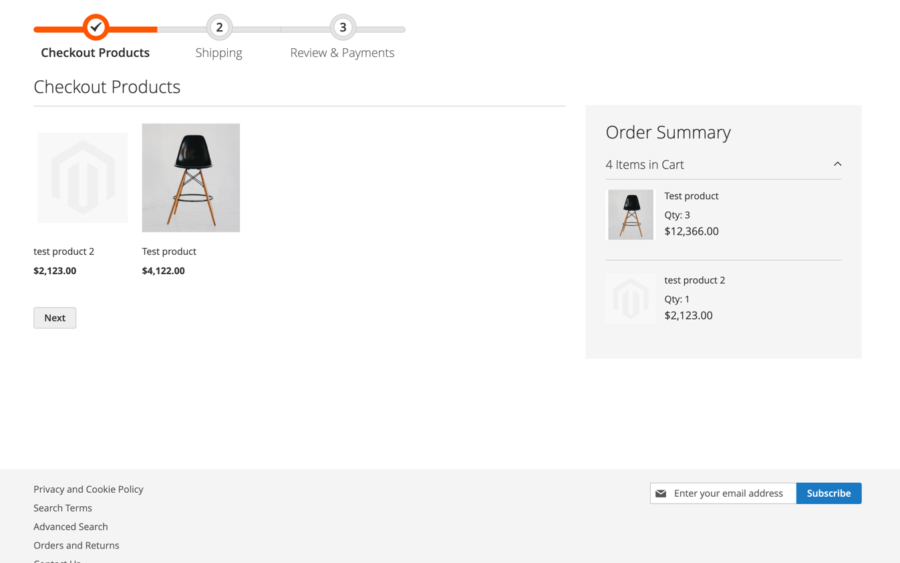
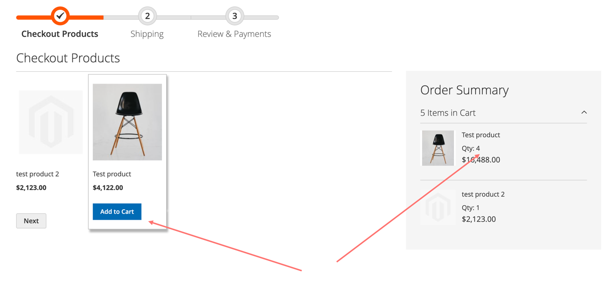
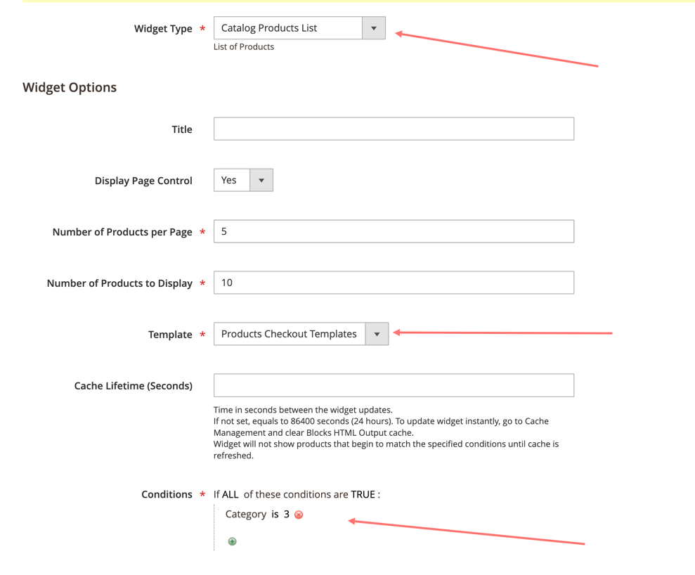

# Products on the checkout page (Magento 2)

Need to create new cms block in admin panel

* **Block Title**: New step checkout Content
* **Identifier**: checkout_new_step_content

In pagebuilder need to add html element and click "Insert Widget..."

| Widget Options | Value                           |
|----------------|---------------------------------|
| Widget Type    | Catalog Products List           |
| Template       | Products Checkout Templates     |
| Conditions     | Need to select special category |

